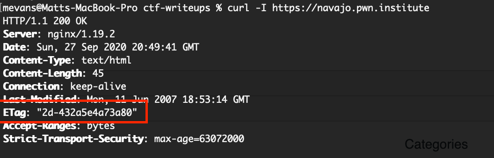
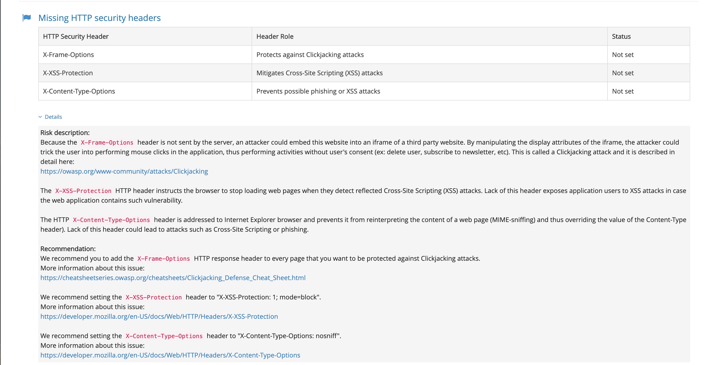
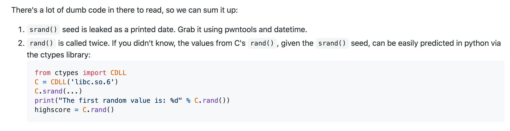
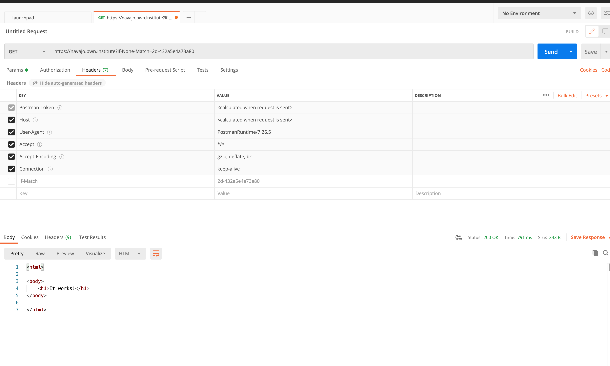

# DownUnder CTF

### Team name: 466 Crew

### Challenges completed

|Category|Name|Points|
|--------|----|------|
|welcome|My glass is empty?|10|

Our team was only able to resolve one challenge which was the freebie you get from logging into their IRC :/

---

### Challenge summary

#### Challenges attempted

|Category|Name|Points|
|--------|----|------|
|web|Navajo|148|
|web|Let Me See|448|
|pwn|Mindgames 1336|443|
|misc|Noob Game|497|

Our team attempted several challenges and were unable to solve any in time.  Below is a summary of each challenge.

- **web/Navajo**

    -  This challenge just provided you with a URL https://navajo.pwn.institute.  The challenge description was "What is the status of Navajo tribes nowadays?".  Since it mentioned status I tried something basic like https://navajo.pwn.institute/status or https://navajo.pwn.institute?status=flag but that didn't yield anything.
    -  I tried hitting the URL using curl and checking the response code.  It was returning a `200 OK`.  One thing I noticed was an `ETag` in the response   I've never seen that before so I searched online for etag usage and after reviewing several resources I found this [StackOverflow](https://stackoverflow.com/a/12475760/6020034).  I found out that a client making a HTTP request can add the http header `If-None-Match` and set the header's' value to the etag that was returned from the server in the original request for the resource. Passing this header in subsequent requests will cause the server to respond with a `304 Not Modified` versus a `200 OK` (and the actual requested resource) **IF** the resource has NOT been modified since the last request.  This is a useful optimization you may make if you make many requests for a resource that is rarely updated. However, I don't see how it could be used as an exploit but I tried it anyways i.e. `curl -I -v --header 'If-None-Match: "2d-432a5e4a73a80"' https://navajo.pwn.institute` and it returned a 304 as expected.  So I learned something new but ultimately this information is not helpful in solving the challenge.
    - Since I've never done a web challenge before so I wasn't really sure where to start so I started by familiarizing myself with basic web exploits @ https://ctf101.org/.  This led to me trying some basic things like Directory traversal i.e. https://navajo.pwn.institute/flag.txt but the response was "Try harder." :/
  
    - Next, on a whim I decided to google a website scanner and I clicked on https://pentest-tools.com/website-vulnerability-scanning/website-scanner.  I wasn't really confident it would help at all but I figured I'd give it a try.  It had a free version which gave some basic details and a paid version which gave more.  I only explored the free version.  It didn't help me get any closer to an exploit but I did learn some information about HTTP security headers and they did provide some good insight on what security risks are associated with each. 
    - I noticed one of the security header attacks was related to something called Cross-Site Scripting which was also referenced @ [ctf101.org/cross-site-scripting](https://ctf101.org/web-exploitation/cross-site-scripting/what-is-cross-site-scripting/#:~:text=Cross%20Site%20Scripting%20or%20XSS,over%20a%20user's%20web%20browser.) but when i tried https://navajo.pwn.institute/?status=%3Cscript%3Ealert(1)%3C/script%3E nothing happened.  I realized I probably need to spend a fair amount of time understanding this so I moved on at this point from looking into this as an exploit so I could try out other challenges.
    - I tried searching prior writeups just to get an idea of how some of these challenges work.  I went to websites like https://ctftime.org/writeup and https://medium.com/bugbountywriteup/angstrom-ctf-2018-web-challenges-writeup-8a69998b0123. While they did give me a better understanding to the type of challenges in the web category I still was unable to solve the challenge after reviewing this information.  I chose to move on to other challenges instead of continuing to explore a solution for this becuase I didn't think I had a strong enough background to complete the web challenges in time.

- **web/Let Me See**
  -  This challenge  https://let-me-see.pwn.institute/ allowed you submit a URL in a form and would display the source code of the website.  One requirement is that URL had to be prefixed with `http://`.  We tried to use `http://localhost` to see the source code of the server but that just returned `Your IP address is 127.0.0.1. PRIVILEGED MODE ENABLED.`.  We tried alternatives to localhost i.e. `http://127.0.0.1` and `http://0.0.0.0` but we got the same response.  I even found out about something call octal IP notation [source](https://gist.github.com/terjanq/e2198440c4fdfbdec43e921b600d4a1d#tokyowesterns-ctf-2020--writeups-by-terjanq) and tried using `http://0177.0.0.1/` but we still got the same response.
  -  We tried seeing if Directory traversal worked, i.e. `http://localhost/flag.txt` but we got a response that said "Wrong way".".  There was also greyed out HTML that said `Your IP address is 10.2.32.1`.  So we had two clues, the "wrong way" response and the greyed out HTML. Unfortunately we weren't able to figure out the significance of the greyed out HTML hint.
  -  We tried the basic steps mentioned above for web/Navajo as well to no avail.

-  **pwn/Mindgames 1336**
   -  This challenge did not provide the source code, only the binary.  I got an overview of what I could using strace, ltrace, strings, Ghidra, and Binary ninja.  I was able to get a high level overview of what was going on but I wasn't able to really get a clean decompile of the source code using Ghidra or Binary Ninja.  I wasn't able to make much progress.  
   -  I did read one of the writeups for this challenge afterwards, https://github.com/IRS-Cybersec/ctfdump/blob/master/BalCCon2k20/mind.md.  In this writeup the attacker was able to get ta pretty good idea of what the original source code was.  I wasn't able to obtain as much information as the attacker through tools I used such as Ghidra and Binary Ninja.  Maybe it's how I'm using those tools and just need more experience. This attacker also knew of a very specific piece of information , and they used a tool [pwnscripts](https://github.com/152334H/pwnscripts) to exploit the code.  I'm not sure how well known it is that that `rand()` and `srand()` can be easily predicted, but I know it now :).  But this challenge seemed like you need prior experience in these type of challenges to be able to complete it.
-  **misc/Noob Game**
   -   This was a challenge that provided a gif of a chess game taking place.  I've never done a challenge like this at all so I just googled it.  I couldn't really find any good sources on it except https://ctf-wiki.github.io/ctf-wiki/misc/picture/gif/ but it didn't help me obtain the flag.  I did this at the end of the challenge so didn't get to spend more time on it otherwise.
   -   

**Notes**:
- In my web challenges I discovered a pretty neat graphical tool [Postman](https://www.postman.com/) to inspect web requests 