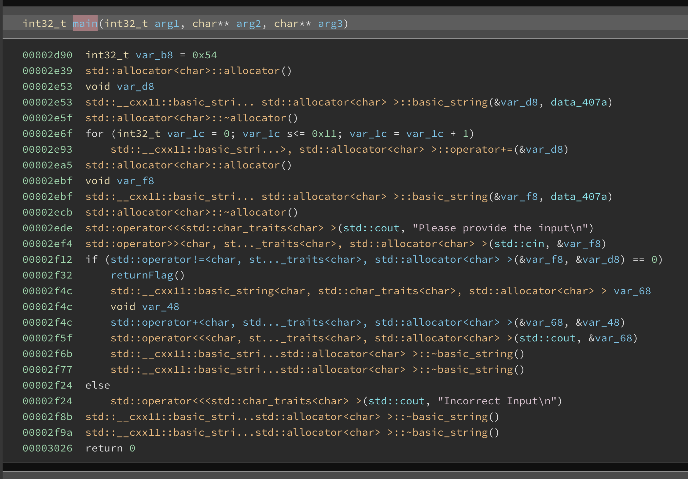
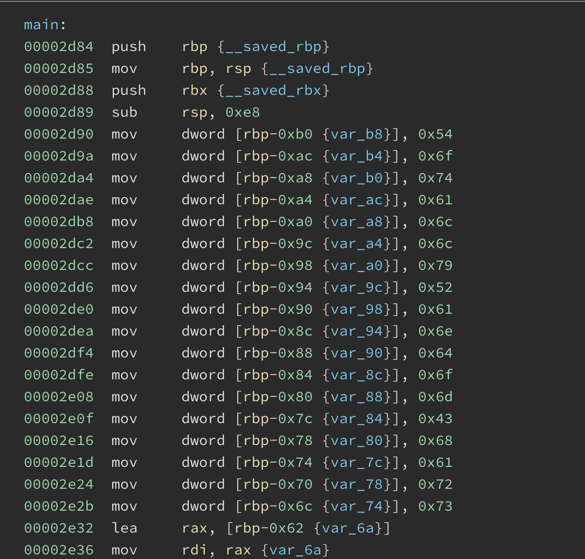
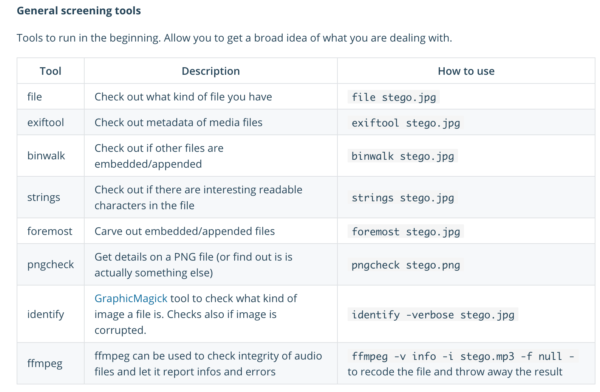

# Affinity CTF / Balsn / Hack For Troops

### Team name: 466 Crew

Taylor Bart, Matt Evans, John Tiffany,  Kamal Nadesan, James Taylor

### Challenges completed Affinity

|Category|Name|Points|
|--------|----|------|
|RE|Magic Word|120|
|OSINT|DIGme|10|
|STEGO|One is missing|10|

We only completed a couple challenges.  We competed in three separate CTF's but they were all pretty tough even the easier ones were tough because they were new concepts to us.  As of writing this two of the CTF's websites (Hack for troops and Balsn) are inaccesible so I'm focusing this writeup on Affinity CTF in order to make the submission deadline.  

### Magic Word

Running the app prompted for input.  Presumably the input was the "magicword" the would unveil the flag.  Looking at the decompiled code in Binary Ninja was a little different than what I was used to seeing 

But switching to the assembly made it a lot easier.  There were a bunch of characters being pushed. 
 Converting the hex to ascii yielded `TotallyRandomChars`.  Entering that as the input got us the flag

```bash
root@020840960a61:/ctf# ./magicword 
Please provide the input
TotallyRandomChars
AFFCTF{h4v3AG00dD4y}
root@020840960a61:/ctf# exit
```

### OSINT

This turned out to be super simple but actually took me a really long time unfortunately. I should have took the name of the challenge as a big hint but for some reason I thought dig meant to search the source code or finding something hidden somewhere.  It turned out to be that "DIG" meant the linux application dig (for DNS lookups).  I was really only familiar with nslookup for queriying DNS to I had to read up on dig.  I tried several dig commands but I wasn't really getting anything back aside from the dns records.  But after more reading I found out to query specifc DNS records for example txt

This returned some extra information

```bash
mevans@Matts-MacBook-Pro ctf-writeups % dig www.affinityctf.com txt

; <<>> DiG 9.10.6 <<>> www.affinityctf.com txt
;; global options: +cmd
;; Got answer:
;; ->>HEADER<<- opcode: QUERY, status: NOERROR, id: 32478
;; flags: qr rd ra; QUERY: 1, ANSWER: 1, AUTHORITY: 0, ADDITIONAL: 1

;; OPT PSEUDOSECTION:
; EDNS: version: 0, flags:; udp: 4096
;; QUESTION SECTION:
;www.affinityctf.com.           IN      TXT

;; ANSWER SECTION:
www.affinityctf.com.    1800    IN      TXT     "QUZGQ1RGe0hlcmUnNXkwdXJUcmVhNXVyZX0="

;; Query time: 21 msec
;; SERVER: 192.168.0.1#53(192.168.0.1)
;; WHEN: Mon Nov 16 20:18:17 MST 2020
;; MSG SIZE  rcvd: 97
```

The txt was base64 encoded.  Because I'm a fan of one liners I took some time and came up with `dig www.affinityctf.com txt | grep = | cut -d '"' -f 2 | base64 --decode`

```bash
mevans@Matts-MacBook-Pro ctf-writeups % dig www.affinityctf.com txt | grep = | cut -d '"' -f 2 | base64 --decode
AFFCTF{Here'5y0urTrea5ure}
```

and there was the flag!

### STEGO

This was a stenography challenge.  I usually don't look at these challenges and other people on our team are the ones that take these on when we split up sometimes.  This one was so easy you could actually just open up the image in a text editor and scroll through the text to find the flag, which was at the end.  However, I decided to spend some time reading up on stenography and approaching it a more challenging manner.  I found a good source to get the basics, https://www.geeksforgeeks.org/image-steganography-in-cryptography/.  From there I tried searching online for stenography tools.  I tried uploading the image to several sites but their attempts to render the flag were worse then opening it up in a text editor.  

So next I searched for stenography tools to use on Ubuntu since that's typically the OS I use.  I found one called [stegosuite](http://manpages.ubuntu.com/manpages/bionic/man1/stegosuite.1.html) which seemed pretty easy to use but I was having issues getting it to work in my docker container (it kept complaining about a missing X11 display).  After spending a few minutes trying to resolve that issue I gave up.  I decided to search online for a docker image specifically made for stenography.

I found a great docker image to use, https://hub.docker.com/r/dominicbreuker/stego-toolkit/.  All I have to do is mount in my directory with my images, create a container, and I can run all kinds of cool commands.  Here were there general commands

I was able to tell using the `binwalk` command to see that there were hidden files embedded in the image, specifically a file called `Hidden.txt`


```bash
root@0a9e53b360f2:/data# binwalk full_of__cuteness.jpg 

DECIMAL       HEXADECIMAL     DESCRIPTION
--------------------------------------------------------------------------------
0             0x0             JPEG image data, JFIF standard 1.01
30            0x1E            TIFF image data, big-endian, offset of first image directory: 8
204234        0x31DCA         Zip archive data, at least v2.0 to extract, compressed size: 20, uncompressed size: 20, name: Hidden.txt
204350        0x31E3E         End of Zip archive, footer length: 22
```

Running the `strings` command provided the flag

```
root@af3fcd75910e:/data# strings full_of__cuteness.jpg  | grep CTF
Hidden.txtAFFCTF{HIDDENKITTEN}PK
```

So while I could have just opened this image in a text editor this seems like a better tool to use and I think positions us to take on more difficult stenography challenges in the future