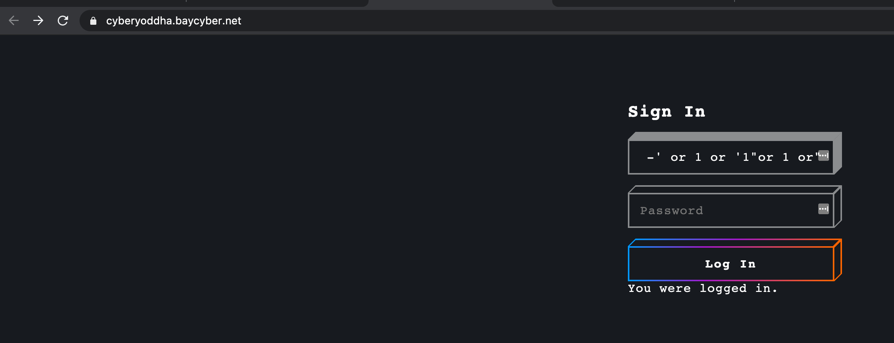

# cyber-yoddha CTF

### Team name: 466 Crew

Taylor Bart, Kamal Nadesan, John Tiffany, Matt Evans, Ryan Dunn

### Challenges completed

|Category|Name|Points|
|--------|----|------|
|misc|Lorem Ipsum|125|
|Forensics|Image Viewer|125|
|Forensics|The row beneath|150|
|Cryptography|Beware the Ides of March|50|
|Cryptography|Sus|200|
|Binary Exploitation|Overflow 1|125|
|Reverse Engineering|Password 1|125|
|Reverse Engineering|Password 2|175|
|Reverse Engineering|YayRev|200|
|Reverse Engineering|Password 3|225|
|Web Exploitation|Look Closely|50|
|Web Exploitation|Disallow|100|
|Web Exploitation|Data Store|175|
|Password Cracking|secure (i think?)|150|
|Password Cracking|Crack the Zip!|200|
|Shebang|shebang0|125|
|Shebang|shebang1|125|
|Shebang|shebang2|150|
|Trivia|Trivia 1|100|
|Trivia|Trivia 2|150|
|Trivia|Trivia 3|100|
|Trivia|Trivia 4|50|
|Trivia|Trivia 5|50|
|Trivia|Trivia 6|100|
|Trivia|Trivia 7|50|
|Trivia|Trivia 8|50|


Our team completed 26 challenges not including the welcome challenge.  This was a pretty easy challenge compared to others which is why were able to get so many flags.  But there were some hang ups as well.  Since there were so many challenges completed this write up only covers several of the challenges.

### Forensics::Image Viewer

This challenge was solved by loading the image in an online forensics tool http://fotoforensics.com/ and inspecting the metadata.


### Forensics::The row beneath

This challenge was solved by opening the image in a hex editor.  In this case the tool that was used was http://www.hexworkshop.com/overview.html and the flag was the last line of the file.

### Web Exploitation::Data Store

This challenge was a simple SQL injection.  Entering `or 1-- -' or 1 or '1"or 1 or"` in the username field resulted in the flag being returned.  

#### Cryptography::Beware the Ides of March

This was a simple Caesar Cipher.  Entering the key `JFJAM{j@3$@y_j!wo3y}` in an online tool https://www.dcode.fr/caesar-cipher yields the flag (fyi - the shift is +7)

#### Cryptography::Sus

This was another simple one, but first you had to identify the ciphertext.  In this case the hint was telling talking about salad, maybe "vigenere" ?

> We picked up on some suspicious activity at a nearby salad bar. We sat down to talk with the manager. He was quite nervous during the interview, but he slid this message to us: ooflgqofllcedopwvtnhyacwllhehdl. Can you find out what it means?
> 

Entering the "message" `ooflgqofllcedopwvtnhyacwllhehdl`  using this online tool https://www.dcode.fr/vigenere-cipher yiels the key `salad` and the flag `wouldyoulikesomevinegarwiththat`

#### Shebang::shebang2

Shebang were a series of linux challenges.  This specific challenge provided a file system of a bunch of directories with long trees of recursive directories nested within them and some had files in them so it was almost impossible to find all the files manually, or it at least would have taken a long time. Most files had the string `This is not a flag` in them.  Eventually putting the right linux command together yielded the file that did not display this string and this is the file with the flag.  The command executed was `find . -type f | xargs grep -v 'This is not a flag'` where the trick was to use the `-v` option to exclude files with that match.

#### Shebang::shebang3

The challenge hint said "these files are the same" and after logging into the remote server there were two files, file.txt and file2.txt.  A brief inspection of these two files showed that they were password files and for the most part looked the same.  But a quick check of the md5sum of the files proved they were not the same.  These files were around 150MB in size and there wasn't an editor available even if we did want to inspect them manually.  The only tool (that we knew of) to inspect the file in some sort of readable manner was the `more` command.  But obviously the size of the files made that difficult.  Eventually we found a command that would find the difference between the two files and output them.  We discovered multiple ideas of how to achieve this which are covered in this stack overflow, https://stackoverflow.com/questions/18069611/fastest-way-of-finding-differences-between-two-files-in-unix/18069688#18069688.  Interestingly enough grep (which does not require a sort) worked the best.  The other commands did not yield the results.

```bash
shebang3@c18466cfac18:~$ grep -Fxvf file.txt file2.txt 
C
Y
C
T
F
{
S
P
T
T
H
F
F
}
peque�a
contrase�a
�repod
```

### Notes

The shebang3 challenge had password files that were sourced from a popular online password file `rockyou.txt`.  However, I noticed in inspecting the file there were racist terms and other offensive content in the password files.  I mentioned it to the authors of the CTF.  I was not offended but I know times are sensitive these days (i.e. switching from "master" to "main" as default branches, etc). I mentioned it to the managers of the CTF and they said they'll consider it for future CTF's.  I don't see why those couldn't easily be filtered for a competition.  But I guess I'll found out the more CTF's I do whether or not offensive material is typically filtered or not.