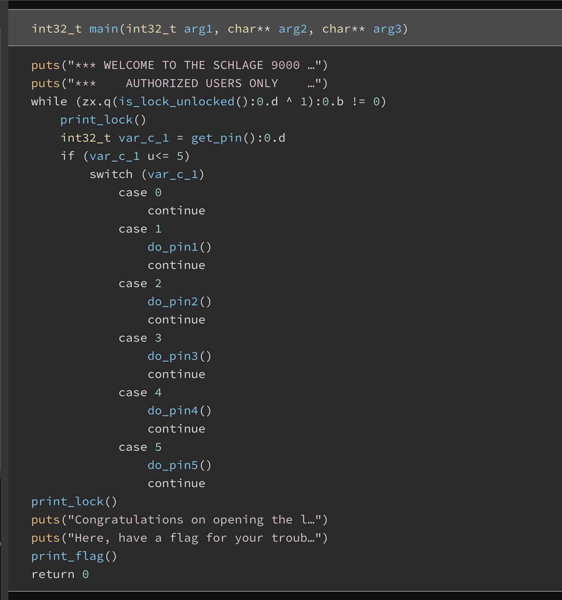
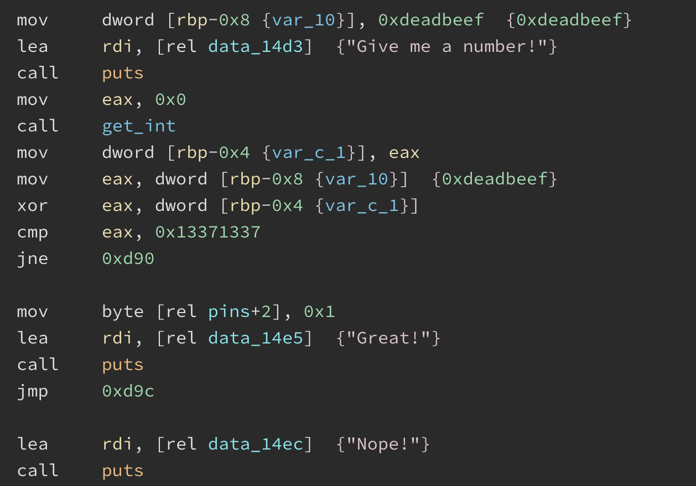
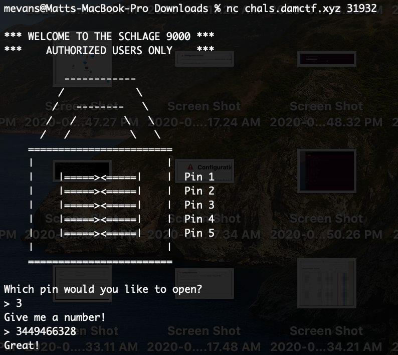

# DownUnder CTF

### Team name: 466 Crew

Taylor Bart, John Tiffany, Ryan Dunn, and Haytham Mouti

### Challenges completed

|Category|Name|Points|
|--------|----|------|
|web|finger-warmup||


Our team was only able to resolve one challenge which was the `web/finger-warmup`.  We did make progress on the rev and pwn challenges but were not able to get the flag.  I worked on the web and rev challenge.

---

### Challenge summary


#### Challenges attempted

|Category|Name|Points|
|--------|----|------|
|web|finger-warmup||
|rev|schlage||


- **web/finger-warmup**

    -  This challenge was pretty straight forward and was pretty easy to figure out what the exploit was by the name of the challenge and viewing the webpage.  When you hit the url https://finger-warmup.chals.damctf.xyz it would render html with the same url and a uuid appended to it, i.e. https://finger-warmup.chals.damctf.xyz/dyyk5f2z0tk1a0tjheqglw.  If you click the new link it would refresh the page and render the url with a new uuid.  So it seems that you could click the new link over and over again (hence the name "finger-warmup") until you eventually land on the flag OR you could automate it.  The challenge gave hints that using python and its request library along with a python html parser would help.  However I don't use python that often and for the sake of speed I decided to write a script in Ruby.  I will note that I observed my script ran a lot faster on an online interpreter https://repl.it/~ versus running it locally.  I didn't spend anytime though investigating why, but now I will try an online interpreter in the future first when doing similar challenges just to see if it's faster.  Maybe it had to do with the geo location but there are many factors obviously.  Anyhow, here is my script

```ruby
require 'net/http'

def href(html)
    match = /href\s*=\s*"([^"]*)"/.match(html)
    return match[1] if match
end

uri = URI('https://finger-warmup.chals.damctf.xyz')
resp = Net::HTTP.get_response(uri)
parsedHref = href(resp.body)

start=0
finish=5000
until start > finish do
    recursiveUri = URI("https://finger-warmup.chals.damctf.xyz/#{parsedHref}")
    recursiveResponse = Net::HTTP.get_response(recursiveUri)
    parsedHref = href(recursiveResponse.body)
    if parsedHref.nil?
        puts "Flag found! It took #{start} http requets to find it."
        puts recursiveResponse.body
    end
    start += 1
end
```

The logic I used in my script was to hit the base url, then parse the uuid from the response.  Then hit the url again but this time append the parsed uuid.  Rinse and repeat this process until I no longer was able to render the uuid.  If the uuid was null then I assume the server responded with something other than the url (maybe the flag?).  At the point of my code where I run into a null uuid I print out the entire response body instead.  Luckily my assumption was correct and it prints the flag.  I forgot to break from my script though after the flag was returned and originally my script was set to run  5000 requests.  So when the flag was found at request #998 the script kept running and *interestingly* enough I noticed the flag would render at 1998, 2998, 3998, etc. So it looks like the challenge gods were giving us multiple opportunities to get the flag.  I kept this in mind for other challenges.

- **web/schlage**

   - This challenge took me an entire day I still didn't complete it BUT I got to a point where I was on my way I just needed more time so I feel good about that.  
   - I started by running the program.  The hint of the challenge indicated that data was lost on a flash drive and we had to recover the pin to unlock it and recover the data. When I ran the program it asked me to pick a pin between 1-5.  If I selected any number other pin 3 the program exits.  If I selected pin3 it asked me to enter a number and when I entered 123 it said "Nope!".  At this point I figured I need to figure out what number to input so I loaded the binary in Binary ninja.
   - I got a feel for the program at a high level overview.  I didn't really need to decode anything it was pretty easy to read 
   - In hindsight I probably should have figured out the logic quicker but I kind just went all over the place inspecting each function and trying to find a vulnerability.  I actually found a couple that I thought could be a vulnerability which also should have been a hint in hindsight but it didn't click.  Because the behavior of the app dictated that only pin 3 was accessible at first I started working on that function `do_pin3()`  
   - My goal was to access the "Great!" address.  This resembled some of the challenges in our own cse466 course.  There was a XOR key that was used to XOR the input and then the app compared the result.  I wrote a script that allowed me to enter the desired output in hex and the XOR key (the key the input is xor'd with).  The script then outputs the input you need to get the desired output.  This script took me a little while to put together but now I can reuse on it on any challenge that I need to crack a xor for. 
```ruby
hex_key = '0xdeadbeef'
hex_bytes = hex_key.split('0x').join("").scan(/.{2}/)
hex_targets = %w[13 37 13 37]

output = []
count = 0
hex_targets.each do |target|
    key = hex_bytes.at(count)
    puts "key is: #{key}"
    key_bin = key.hex.to_s(2).rjust(key.size*4, '0').split("")
    puts "key_bin is: #{key_bin}"
    target_bin = target.hex.to_s(2).rjust(target.size*4, '0').split("")
    puts "target_bin: #{target_bin}"
    result = []
    tcount = 0
    target_bin.each do |bit|
        if target_bin.at(tcount).to_i.eql?(0) && key_bin.at(tcount).to_i.eql?(0)
            result.push(0)
        end

        if target_bin.at(tcount).to_i.eql?(0) && key_bin.at(tcount).to_i.eql?(1)
            result.push(1)
        end

        if target_bin.at(tcount).to_i.eql?(1) && key_bin.at(tcount).to_i.eql?(0)
            result.push(1)
        end

        if target_bin.at(tcount).to_i.eql?(1) && key_bin.at(tcount).to_i.eql?(1)
            result.push(0)
        end
        tcount += 1
    end
    count += 1
    count = 0 unless count < hex_bytes.size
    output.push(result)
end

ascii = []
output.each do |out|
   puts "output: #{out.join("")}, #{out.join("").to_i(2)}, #{out.join("").to_i(2).to_s(16)}, #{out.join("").to_i(2).to_s(16).split(" ").pack('H*')}"
   ascii.push("#{out.join("").to_i(2).to_s(16).split(" ").pack('H*')}")
end

puts ascii.join("")
```

The desired output was `x13171337`, since my script calculates byte for byte you have to setup the hex_targets variable like so `hex_targets = %w[13 37 13 37]` with a space between each. The script output was;  `0xcd9aadd8`. So I then took `0xcd9aadd8` and converted it to decimal which results in `3449466328` .  Using that as the pin for #3 worked 

I then started to look at the other functions and then it occurred to me...I need to unlock all 5 functions to get the flag :/.  Also there appears to be a specific order in which to unlock the keys.  For example, you can't access pin1 to even try to unlock it until pin3 has been unlocked.  After some digging I found the sequence of pins to be unlocked to be `3 > 1 > 5 > 2> 4`.  I got 3 figured out and started on #1, it was doing an AND on the last byte and comparing a new result but I didn't get far enough to finish it.

**NOTE**

As I work on the challenges for toddler I'm starting to realize the benefits of using pwn tools.  I'm working on converting the ruby scripts to python/pwn tools.