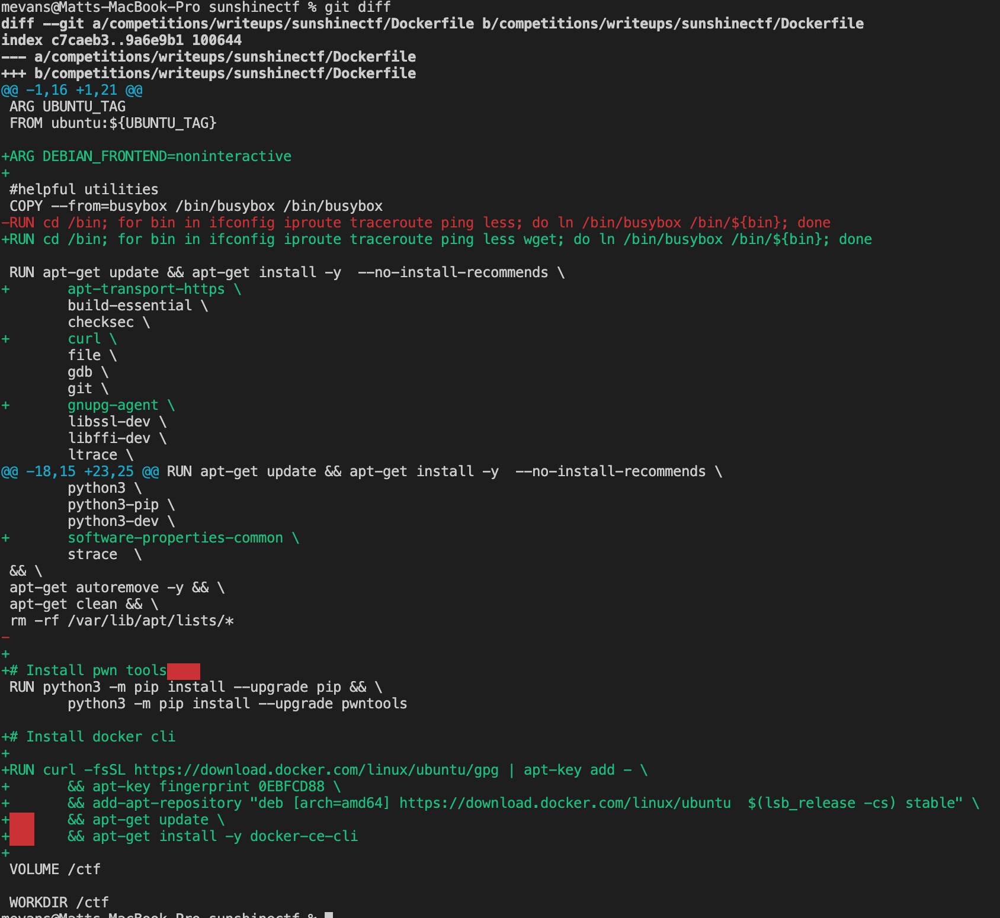

# Dragon CTF

### Team name: 466 Crew

### Challenges completed


---

### Challenge layout


Our team attempted several challenges and were unable to solve any in time.  Below is a summary of each challenge I worked on.

### Challenges Attempted

#### Look up the flag

This was challenge was rated with a difficultly level of easy and was worth 302 points but only had 23 solves.  We spent several hours on this challenge and were unable to find the flag.


Steps

after spending sometime online searching how to use dig we started exploring by running some basic commands like.  Together we learned that the IP address `dig forward-lookup.hackable.software` resolved to `35.246.141.229` was being used as a name server.

Running `dig all @35.246.141.229 forward-lookup.hackable.software 3133` produced 

We tried other options as well (such as running lookups on Exception.in-exceeption.catch and other domains) but none were successful

We kept running into dead ends i.e. 

We spent a lot of time reviewing other previous CTF's but were unable to figure this one out.  We  also tried to inspect the packets in wireshark (note - filter used `udp.port == 53`) but there wasn't any additional information we could find.  

### RetroZeit

This challenge just had one hint:

> Just wait for the flag. Works on AmigaOS 3.x (workbench).

It also provided a binary.

After downloading it and inspecting it we found 

```bash
root@020840960a61:/ctf# file retrozeit 
retrozeit: AmigaOS loadseg()ble executable/binary
```

We never heard of AmigaOs so we googled it.  It looks like you had to purchase it, i.e. https://www.amigaos.net/content/4/where-buy.  We couldn't find any virtual machines to spin up.  

We found a couple different docker solutions that looked promising https://github.com/sebastianbergmann/ and https://hub.docker.com/r/jamesnetherton/fs-uae/  but we were unable to get the binary to run.  We spent a couple hours working on this because it seemed simple enough that i just had to run the binary in the OS.  It was also the 2nd most solved challenge so we'll have to read the write ups to see how this one was solved.

One neat thing we learned though in the course of trying to figure this out which is what took up most of our time was how to run docker inside of a docker container.

I ran the script from https://github.com/sebastianbergmann/ in a ubuntu container and it failed because the "docker command was not found".  I tried to install docker via apt-get but it wasn't working and then after doing some research I found that "docker in docker" is actually a thing and there are certain ways to do it.  After many iterations I finally found out that I could just install the docker cli without all the overheard of docker but it also took some time to figure out how to update my docker image.

Dockerfile diff


Then before I create the container I can mount in the docker unix socket `/var/run/docker.sock`  to the container as a volume i.e. `docker run -v /var/run/docker.sock:/var/dun/docker.sock`.  Then after I install the docker cli it has access to the docker daemon on my host machine and I can access docker inside of docker! container.

```bash
mevans@Matts-MacBook-Pro sunshinectf % docker run -it --entrypoint bash -v /var/run/docker.sock:/var/run/docker.sock ubuntu-local
root@32e15e3bb9b9:/ctf# docker version
Client: Docker Engine - Community
 Version:           19.03.13
 API version:       1.40
 Go version:        go1.13.15
 Git commit:        4484c46d9d
 Built:             Wed Sep 16 17:02:52 2020
 OS/Arch:           linux/amd64
 Experimental:      false

Server: Docker Engine - Community
 Engine:
  Version:          19.03.13
  API version:      1.40 (minimum version 1.12)
  Go version:       go1.13.15
  Git commit:       4484c46d9d
  Built:            Wed Sep 16 17:07:04 2020
  OS/Arch:          linux/amd64
  Experimental:     false
 containerd:
  Version:          v1.3.7
  GitCommit:        8fba4e9a7d01810a393d5d25a3621dc101981175
 runc:
  Version:          1.0.0-rc10
  GitCommit:        dc9208a3303feef5b3839f4323d9beb36df0a9dd
 docker-init:
  Version:          0.18.0
  GitCommit:        fec3683
```

We tried out a web challenge and RE along with a docker challenge on working around apparmor but we didn't make much progress before we ran out of time.