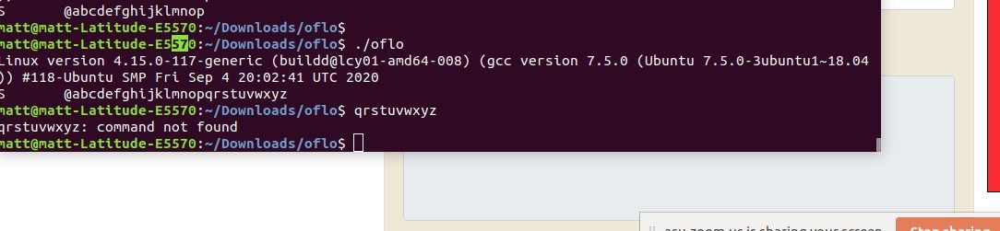
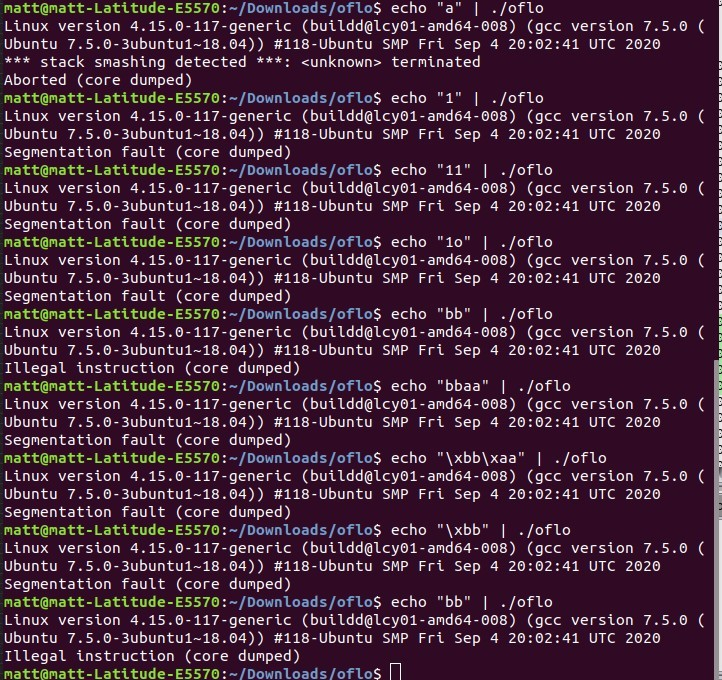
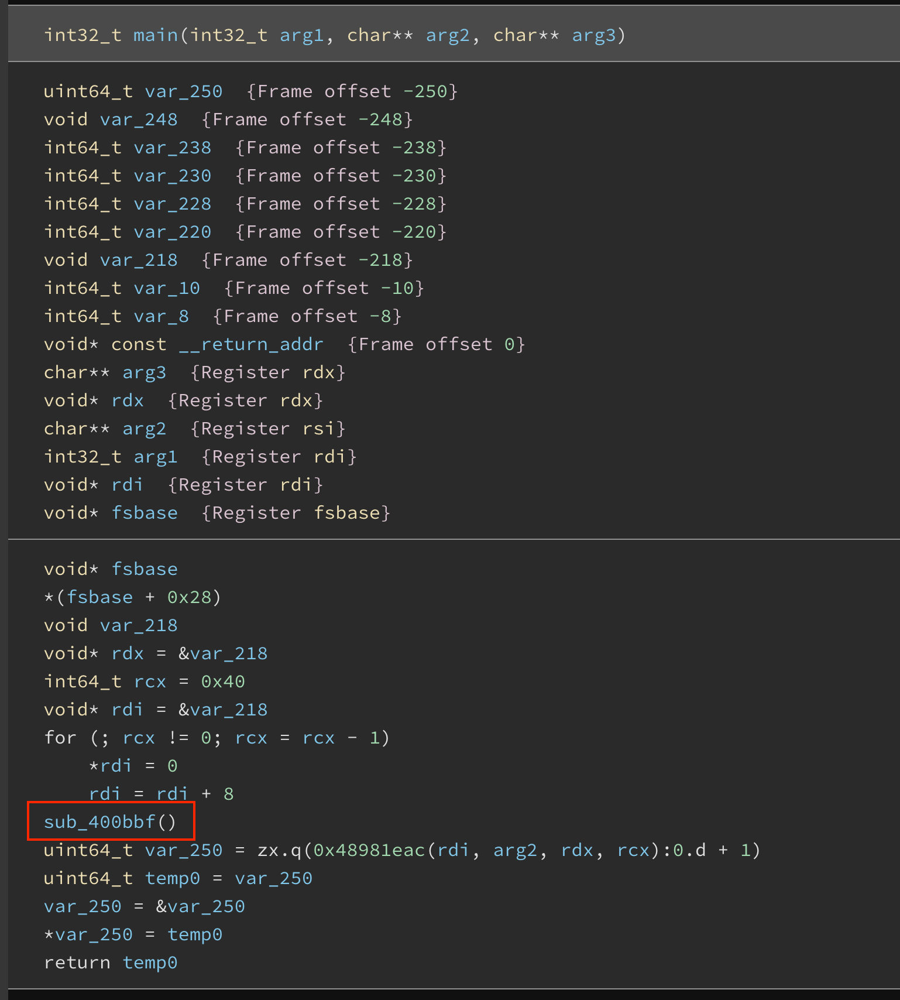
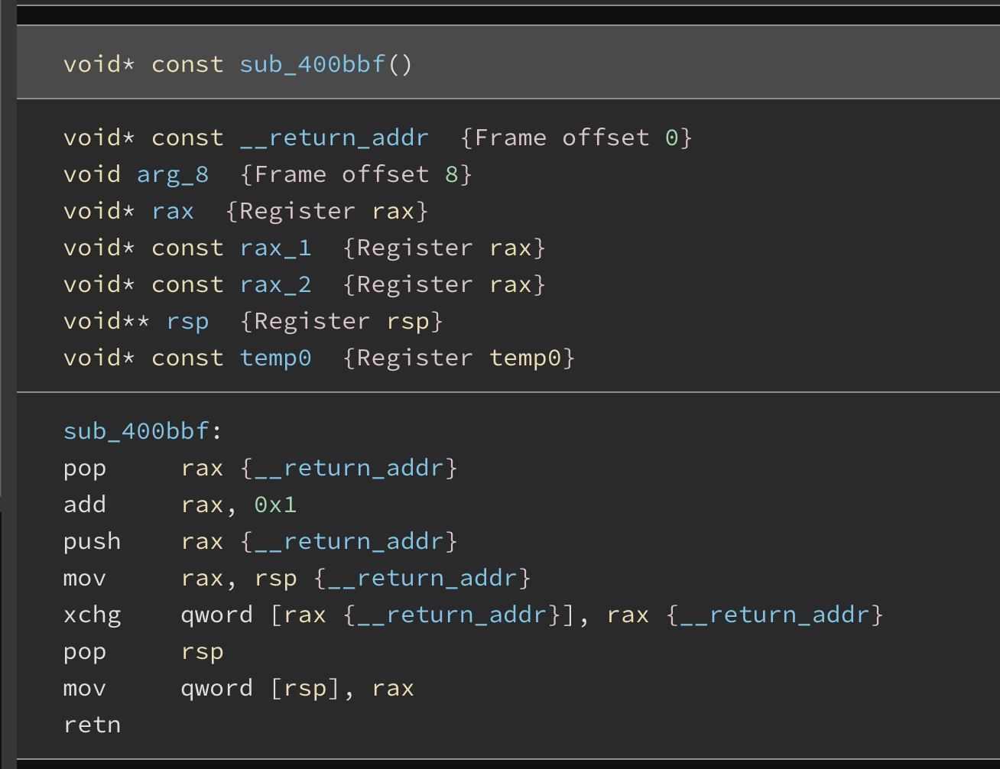
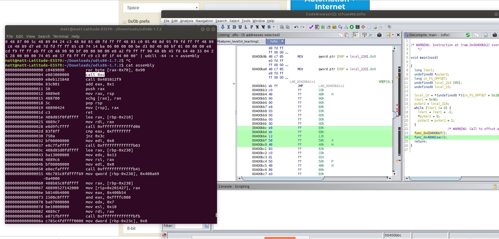
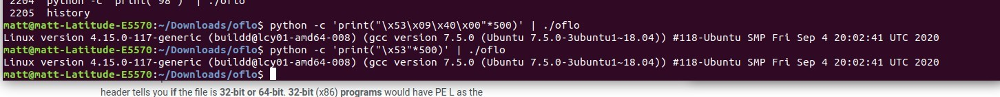
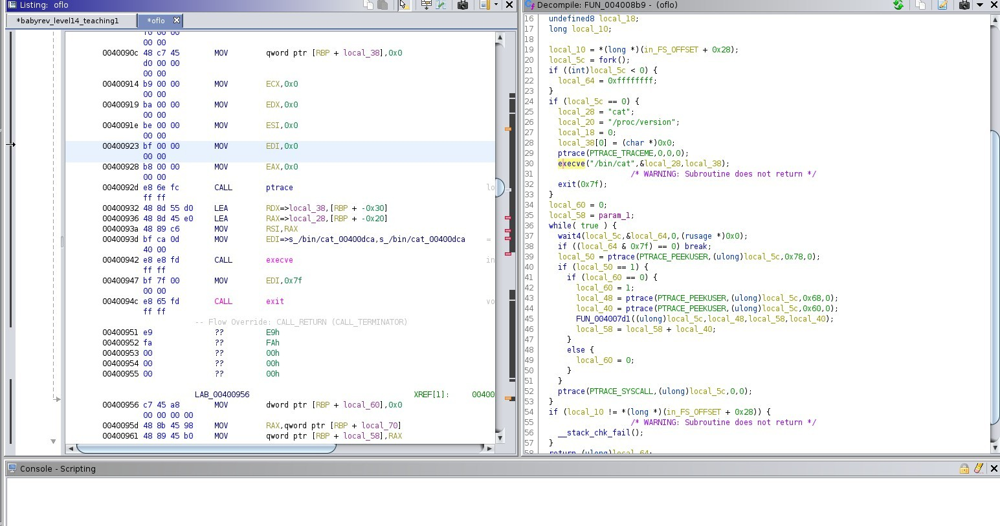

# N1CTF

### Team name: 466 Crew

Taylor Bart, Matt Evans, James Taylor, Mohamed Alqubaisi


### Challenges completed

|Category|Name|Points|
|--------|----|------|
|web|SignIn|69|


 Our team was only able to resolve one challenge which was the `web/Signin`.

---

### Challenge summary


#### Challenges attempted

|Category|Name|Points|
|--------|----|------|
|web|SignIn|60|
|rev|oflo|102|


- **web/SingIn**

    -  This challenge was the freebie for signing up.

- **rev/oflo**

   - I think we started on the wrong path because the name of the challenge was `oflo` we thought that was short for overflow and that this would be an overflow vulnerabilty. It turns out this might not have been related to an overflow which we didn't find out until near the end of the challenge.
   - The challenge only provided a binary to download.  There wasn't any remote server to connect to in order to run the app.  This obviously was a hint that somehow the binary produces the flag instead of having to access a file system and open a file called flag.  You could see from running the program that it appears to run `cat /proc/version` and allows you to enter 19 bytes. 
   - We also tried entering diferent types of input to see what we would get.  We weren't able to figure out the rhyme or reason but we did observe that some inputs would result in a segmentation fault and the others would result in an Illegal instruction error. 
   - We tried to take a look at the binary in Binary Ninja and Ghidra.  Ghidra appeared to decompile the code a little better than Binary Ninja, but Binary ninja was able to identify the main function.  It took some time for us to identify the main function in Ghidra by comparing the assembly of each function in Binary Ninja.  Once we found the main method in Ghidra we renamed it to main.  We then started looking through the function and tried to debug what they were doing.  One function `0x00400bbf` didn't really make any sense.  It looked like it was incrementing the instruction pointer but then appears to reset it.  
   - Another function `0x48981eac` called in `main()` did actually appear to be doing something .  In Ghidra we could only see the hex bytes.  We had to figure out how to translate them to assembly.  I found this [Stack Overflow answer](https://stackoverflow.com/a/7200825/6020034) that indicated you could use a utility called `udcli`.  This gave us the assmebly.  Below are the steps to install this tool and the assembly
```sh
wget http://sourceforge.net/projects/udis86/files/udis86/1.7/udis86-1.7.2.tar.gz/download
tar -xf udis86-1.7.2.tar.gz
cd udis86-1.7.2
./configure
make install
``` 


   - We couldn't get really understand the assembly to much.  There was a `call 0xc` which we weren't sure about.  This could be the `break` sycall but it didn't make sense why we would break immediately in the function.
   - We were kind of stumped at this point.  There were a lot of sub functions in this code and we knew that we were ending up in the function that called `cat /proc/version` just based on that output so we started concentrating on that function.  It appears that when `execve` is called (which calls cat) the command incorrectly hangs and should immediately exit.  We thought this was our chance to enter input to jump to an address we wanted to.  We tried several function addresses but nothing worked.  We did notice for some reason using the byte `x53` as the first byte in the input would result in the program exiting cleanly with a 0 status.  
- But we still weren't really making any progress.  We thought maybe because sometimes the input gives us an illegal instruction we need to send in some sort of instructions instead of an address but we weren't sure what to do.
- Eventually we had another teammate join us who said that we've been looking at it all wrong and that this isn't an overflow challenge but a `"nanomite protected binary with some twist"`.  Unfortunately we didn't have much time left to really traverse down this path. I  didn't even know what a nanomite was.  So I found this [writeup](https://doar-e.github.io/blog/2014/10/11/taiming-a-wild-nanomite-protected-mips-binary-with-symbolic-execution-no-such-crackme/) which was pretty comprehensive (maybe this explains the `0xc`?).  I spent a couple hours reading through this but it didn't help me really figure out our challenge any better.  
- We ran out of time and were unable to get the flag.


**NOTE**

- Review the write-ups for this challenge once they've been posted to make sure this wasn't an overflow challenge and how to solve 'nanomite protected binary' challenges
- Consider joining a new team with more experience.  Our team is a bunch of beginners it seems like and when we get stuck we all kind of get stuck.  We need more team members to get us over the hump when we get stuck.
- Instead of using `udcli` you can use https://github.com/zardus/shelltools
- We spent about an hour or so on a web challenge as well that was a php page.  We think it may have been code injection but none of us new php.  We spent time reading online and trying to inject code like `url@php?input=<serialized input>` because the php page that loaded showed that it was parsing an env variable `input` and deserializing it.  But we didn't really make any progress.