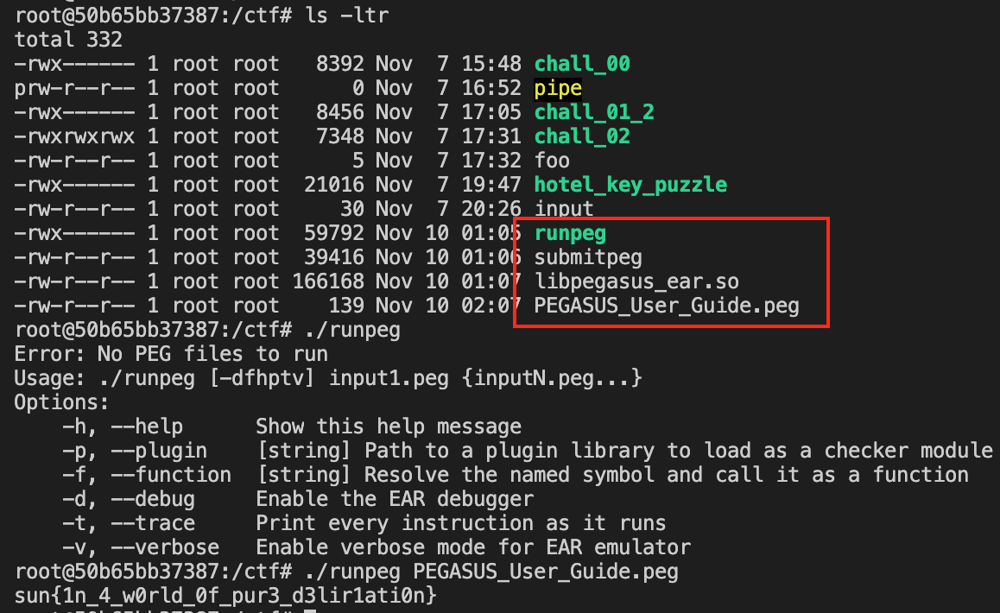
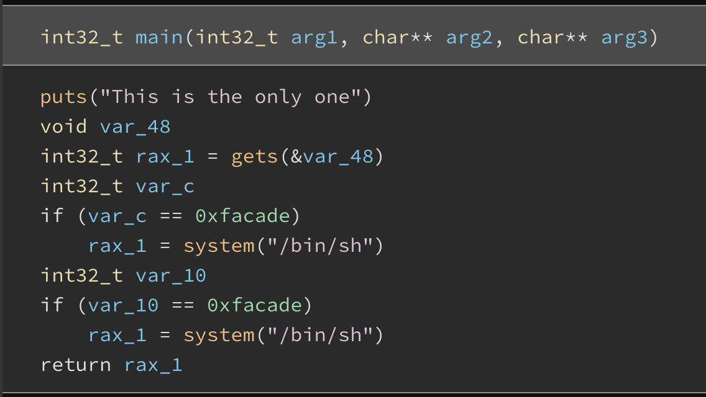
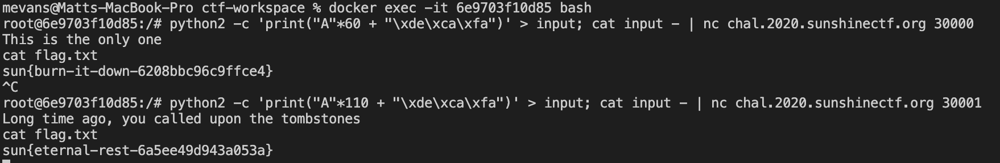

# SunshineCTF 2020

### Team name: 466 Crew

Taylor Bart, Matt Evans, John Tiffany, Kamal Nadesan


### Challenges completed

|Category|Name|Points|
|--------|----|------|
|MISC|Welcome!|1|
|MISC|Disboard Round 2|2|
|PEGASUS|user Guide|10|
|PEGASUS|RTFM|10|
|WEB|Password Pandemonium|100|
|SPEEDRUN|speedrun-00|10|
|SPEEDRUN|speedrun-01|10|


We only completed a few challenges.  We all got stuck on a reversing challenge that took most of our time.

I also spent a fair amount of time getting ready for this CTF.  My computer isMacOS than the systems for these challenges I can't run the binary's on my system and even if I have the source code and can compile it on my system the registers are different and it just makes less than ideal to hack with the back and forth and switching contexts.


So a couple weeks ago I setup a virtual machine on my Mac running Ubuntu 20.04.  However I was unable to get it to run as fast and seemless as I would have liked it to run. Switching from the guest to host OS was lagging and I couldn't go into full screen without a major performance hit. After trying several different configurations I opted to try Ubuntu Server (non GUI).  While this solved my problem of the guest OS lagging I ran into a new issue trying to get Virtual Box's guest additions to work so I was unable to file share or share the clipboard between my host and guest OS.  This made life difficult.  Then it finally occurred to me I can just use a docker container! I thought about using the docker image provided by pwn college but there's too much overhead and there I'm not a fan of the size of the image.  So I decided to spend some time to make a lightweight docker image specifically for these capture the flag events.

### BUILD
`docker build --build-arg UBUNTU_TAG=20.04 -t ubuntu-local .`

### USAGE

`
docker run -it -v $(pwd):/ctf ubuntu-local`

### Dockerfile
```docker
ARG UBUNTU_TAG
FROM ubuntu:${UBUNTU_TAG}

#helpful utilities
COPY --from=busybox /bin/busybox /bin/busybox
RUN cd /bin; for bin in ifconfig iproute traceroute ping less; do ln /bin/busybox /bin/${bin}; done

RUN apt-get update && apt-get install -y  --no-install-recommends \
	build-essential \
	checksec \
	file \
	gdb \
	git \
	libssl-dev \
	libffi-dev \
	ltrace \
	python2 \
	python3 \
	python3-pip \
	python3-dev \
	strace  \
&& \
apt-get autoremove -y && \
apt-get clean && \
rm -rf /var/lib/apt/lists/*
	
RUN python3 -m pip install --upgrade pip && \
	python3 -m pip install --upgrade pwntools

VOLUME /ctf

WORKDIR /ctf

ENTRYPOINT ["/bin/bash"]
```

With this setup I can just download the binaries, files, etc. into my working directory and they will automatically be available in my container's working directory.  Now I can finally use both of my monitors and leverage the computing power of my new laptop and no more overheard of a VM!

___

- **PEGASUS/user Guide**

This one was really simple.  The challenge provided you with 4 files.  I downloaded the files, ran the binary and found the flag. 


- **PEGASUS/RTFM**

This one was even easier.  It gave you two markdown files and the hint said 
> Read the docs and you may find a flag :P

I didn't bother reading the docs I just scrolled to the end of the files and found the flag.

- **SPEEDRUN/speedrun-00/01**

These challenges were basic overflows.  I inspected the challenges in Binary Ninja and was able to reverse them pretty quickly. Here's the gist (i.e. `main()`)

I just had to figure out the padding, then an easy one liner got the job done so I could access the shell on the system.



